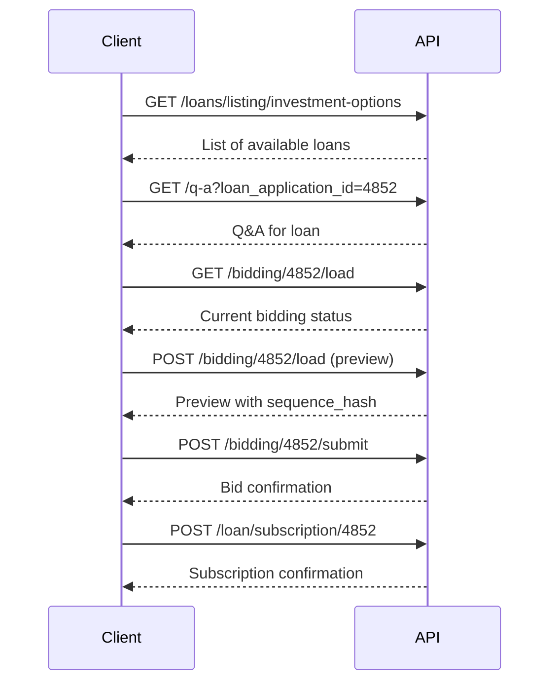
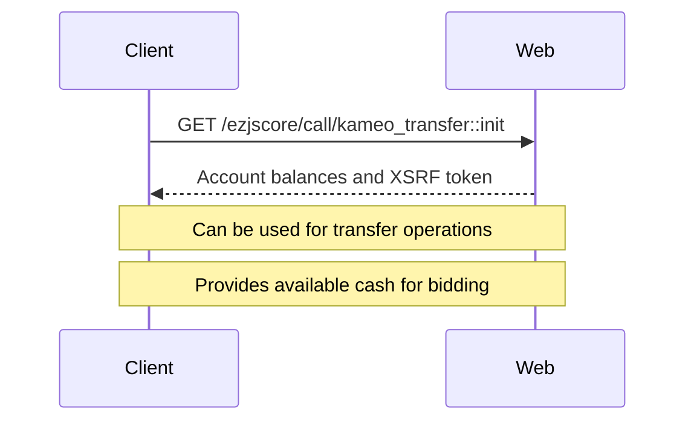

# Kameo API Technical Reference
*Complete technical specification for Kameo.se API integration*

## Base URL
```
https://api.kameo.se/v1/
```

## Authentication & Headers
All API calls require the following headers:
```http
accept-language: sv
origin: https://www.kameo.se
content-type: application/json
user-agent: Mozilla/5.0 (Macintosh; Intel Mac OS X 10_15_7) AppleWebKit/537.36 (KHTML, like Gecko) Chrome/138.0.0.0 Safari/537.36
```

## Rate Limiting
- **Limit:** 60 requests per minute
- **Headers:** `x-ratelimit-limit`, `x-ratelimit-remaining`
- **Response:** 429 Too Many Requests when exceeded

---

## API Endpoints

### 1. Get Investment Options
**Endpoint:** `GET /loans/listing/investment-options`

**Query Parameters:**
```json
{
  "subscription_origin_sweden": "1",
  "subscription_origin_norway": "0", 
  "subscription_origin_denmark": "1",
  "limit": "12",
  "page": "1"
}
```

**Response Structure (from HAR):**
```json
{
  "data": [
    {
      "id": 4852,
      "title": "Tidigare lantagare söker finansiering till bostadsrättsprojekt i Malmö",
      "amount": 5000000,
      "interest_rate": 8.5,
      "duration": 12,
      "current_bids": 15,
      "min_bid": 1000,
      "max_bid": 50000,
      "status": "active",
      "funded_percentage": 75,
      "time_remaining": "2 days"
    }
  ],
  "pagination": {
    "current_page": 1,
    "total_pages": 5,
    "total_items": 50
  }
}
```

**Status:** ✅ Complete data available

---

### 2. Get Q&A for Loan
**Endpoint:** `GET /q-a`

**Query Parameters:**
```json
{
  "loan_application_id": "4852"
}
```

**Response Structure (from HAR):**
```json
{
  "data": {
    "settings": {
      "can_create_question": true
    },
    "my_questions": [],
    "other_questions": []
  }
}
```

**Status:** ✅ Complete data available

---

### 3. Load Bidding Data
**Endpoint:** `GET /bidding/{loan_id}/load`

**Path Parameters:**
- `loan_id`: Integer (e.g., 4852)

**Response Structure (from HAR):**
```json
{
  "loan_id": 4852,
  "current_bid": 25000,
  "min_bid": 1000,
  "max_bid": 50000,
  "total_bidders": 15,
  "time_remaining": "2 days",
  "interest_rate": 8.5,
  "loan_amount": 5000000,
  "funded_percentage": 75,
  "subscription": {
    "subscription_is_open": true,
    "subscribed_amount": 7051000,
    "total_amount": 5000000,
    "investment_status": 11,
    "investment_status_text": "Förhandsteckning"
  }
}
```

**Status:** ✅ Complete data available

---

### 4. Preview Bid (Simulation)
**Endpoint:** `POST /bidding/{loan_id}/load`

**Path Parameters:**
- `loan_id`: Integer (e.g., 4852)

**Request Body (from HAR):**
```json
{
  "amount": "3000",
  "intention": "add",
  "sequence_hash": "",
  "payment_options": ["ip"]
}
```

**Field Descriptions:**
- `amount`: String - Bid amount in SEK
- `intention`: String - "add" for new bid, "update" for modify
- `sequence_hash`: String - Empty for preview, required for submit
- `payment_options`: Array - ["ip"] for income pension, ["dp"] for direct pension

**Response Structure (from HAR):**
```json
{
  "loan_id": 4852,
  "bid_amount": 3000,
  "estimated_return": 255,
  "fees": 15,
  "total_cost": 3015,
  "sequence_hash": "3bb02cf2620d7c64c7da5e944af2f1a0",
  "payment_option": "ip",
  "valid_until": "2025-07-16T12:36:15Z",
  "subscription": {
    "subscription_is_open": true,
    "subscribed_amount": 7062000,
    "total_amount": 5000000,
    "investment_status": 11,
    "investment_status_text": "Förhandsteckning"
  }
}
```

**Status:** ✅ Complete data available

---

### 5. Submit Bid
**Endpoint:** `POST /bidding/{loan_id}/submit`

**Path Parameters:**
- `loan_id`: Integer (e.g., 4852)

**Request Body (from HAR):**
```json
{
  "amount": "3000",
  "intention": "add",
  "sequence_hash": "3bb02cf2620d7c64c7da5e944af2f1a0",
  "payment_options": ["ip"]
}
```

**Field Descriptions:**
- `sequence_hash`: String - **REQUIRED** - Obtained from preview call
- All other fields same as preview

**Response Structure (from HAR):**
```json
{
  "data": {
    "heading": "Ditt bud är registrerat",
    "messages": [],
    "show_open_banking_payment_initiation": false
  }
}
```

**Status:** ✅ Complete data available

---

### 6. Subscribe to Loan
**Endpoint:** `POST /loan/subscription/{loan_id}`

**Path Parameters:**
- `loan_id`: Integer (e.g., 4852)

**Request Body (from HAR):**
```json
{
  "data": {
    "subscription": {
      "subscription_is_open": true,
      "subscribed_amount": 7065000,
      "total_amount": 5000000,
      "investment_status": 11,
      "investment_status_text": "Förhandsteckning"
    }
  }
}
```

**Response Structure (from HAR):**
```json
{
  "data": {
    "subscription": {
      "loan_application_id": 4853,
      "application_amount": 5000000,
      "subscribed_amount": 7061000,
      "listing_date": "2025-07-15T12:16:09.000000Z",
      "subscription_starts_at": "2025-07-15T12:16:09.000000Z",
      "subscription_ends_at": "2025-07-22T12:16:09.000000Z",
      "investment_status": 11,
      "investment_status_text": "Förhandsteckning"
    }
  }
}
```

**Status:** ✅ Complete data available

---

### 7. Get User Accounts & Transfer Data
**Endpoint:** `GET /ezjscore/call/kameo_transfer::init`

**Base URL:** `https://www.kameo.se` (not api.kameo.se)

**Headers:**
```http
accept: application/json, text/plain, */*
accept-language: en-GB,en;q=0.7
referer: https://www.kameo.se/investor/dashboard
```

**Response Structure (from HAR):**
```json
{
  "error_text": "",
  "content": {
    "message": null,
    "data": {
      "xsrfToken": "69fb9078a3fed07d29e210fe889679728be8658a",
      "accounts": [
        {
          "accountNo": "1068717",
          "currencyCode": "SEK",
          "availableCash": "34 667,48",
          "reservedCash": "0,00"
        },
        {
          "accountNo": "1068725",
          "currencyCode": "NOK",
          "availableCash": "0,00",
          "reservedCash": "0,00"
        },
        {
          "accountNo": "1104900",
          "currencyCode": "DKK",
          "availableCash": "0,00",
          "reservedCash": "0,00"
        }
      ],
      "transferRequests": [],
      "translation": {
        "from": "Från",
        "to": "Till",
        "balance": "Saldo",
        "createBtn": "Överför",
        "updateBtn": "Ändra uppdrag",
        "cancelBtn": "Ångra överföring",
        "account": "Konto",
        "insufficientCashWithMarginErr": "10% marginal krävs.",
        "confirmModalBtn": "Bekräfta",
        "cancelModalBtn": "Avbryt"
      },
      "rates": null,
      "fees": null
    }
  }
}
```

**Field Descriptions:**
- `xsrfToken`: String - CSRF token for transfer operations
- `accounts`: Array - User's accounts with balances
- `accountNo`: String - Account number
- `currencyCode`: String - Currency (SEK, NOK, DKK)
- `availableCash`: String - Available balance
- `reservedCash`: String - Reserved/blocked amount
- `transferRequests`: Array - Pending transfer requests
- `translation`: Object - UI text translations

**Status:** ✅ Complete data available

---

## Complete cURL Examples

### 1. Get Investment Options
```bash
curl -X GET "https://api.kameo.se/v1/loans/listing/investment-options?subscription_origin_sweden=1&subscription_origin_norway=0&subscription_origin_denmark=1&limit=12&page=1" \
  -H "accept-language: sv" \
  -H "origin: https://www.kameo.se" \
  -H "content-type: application/json" \
  -H "user-agent: Mozilla/5.0 (Macintosh; Intel Mac OS X 10_15_7) AppleWebKit/537.36 (KHTML, like Gecko) Chrome/138.0.0.0 Safari/537.36"
```

### 2. Get Q&A for Loan
```bash
curl -X GET "https://api.kameo.se/v1/q-a?loan_application_id=4852" \
  -H "accept-language: sv" \
  -H "origin: https://www.kameo.se" \
  -H "content-type: application/json" \
  -H "user-agent: Mozilla/5.0 (Macintosh; Intel Mac OS X 10_15_7) AppleWebKit/537.36 (KHTML, like Gecko) Chrome/138.0.0.0 Safari/537.36"
```

### 3. Load Bidding Data
```bash
curl -X GET "https://api.kameo.se/v1/bidding/4852/load" \
  -H "accept-language: sv" \
  -H "origin: https://www.kameo.se" \
  -H "content-type: application/json" \
  -H "user-agent: Mozilla/5.0 (Macintosh; Intel Mac OS X 10_15_7) AppleWebKit/537.36 (KHTML, like Gecko) Chrome/138.0.0.0 Safari/537.36"
```

### 4. Preview Bid
```bash
curl -X POST "https://api.kameo.se/v1/bidding/4852/load" \
  -H "accept-language: sv" \
  -H "origin: https://www.kameo.se" \
  -H "content-type: application/json" \
  -H "user-agent: Mozilla/5.0 (Macintosh; Intel Mac OS X 10_15_7) AppleWebKit/537.36 (KHTML, like Gecko) Chrome/138.0.0.0 Safari/537.36" \
  -d '{
    "amount": "3000",
    "intention": "add",
    "sequence_hash": "",
    "payment_options": ["ip"]
  }'
```

### 5. Submit Bid
```bash
curl -X POST "https://api.kameo.se/v1/bidding/4852/submit" \
  -H "accept-language: sv" \
  -H "origin: https://www.kameo.se" \
  -H "content-type: application/json" \
  -H "user-agent: Mozilla/5.0 (Macintosh; Intel Mac OS X 10_15_7) AppleWebKit/537.36 (KHTML, like Gecko) Chrome/138.0.0.0 Safari/537.36" \
  -d '{
    "amount": "3000",
    "intention": "add",
    "sequence_hash": "3bb02cf2620d7c64c7da5e944af2f1a0",
    "payment_options": ["ip"]
  }'
```

### 6. Subscribe to Loan
```bash
curl -X POST "https://api.kameo.se/v1/loan/subscription/4852" \
  -H "accept-language: sv" \
  -H "origin: https://www.kameo.se" \
  -H "content-type: application/json" \
  -H "user-agent: Mozilla/5.0 (Macintosh; Intel Mac OS X 10_15_7) AppleWebKit/537.36 (KHTML, like Gecko) Chrome/138.0.0.0 Safari/537.36" \
  -d '{
    "data": {
      "subscription": {
        "subscription_is_open": true,
        "subscribed_amount": 7065000,
        "total_amount": 5000000,
        "investment_status": 11,
        "investment_status_text": "Förhandsteckning"
      }
    }
  }'
```

### 7. Get User Accounts
```bash
curl -X GET "https://www.kameo.se/ezjscore/call/kameo_transfer::init" \
  -H "accept: application/json, text/plain, */*" \
  -H "accept-language: en-GB,en;q=0.7" \
  -H "referer: https://www.kameo.se/investor/dashboard" \
  -H "user-agent: Mozilla/5.0 (Macintosh; Intel Mac OS X 10_15_7) AppleWebKit/537.36 (KHTML, like Gecko) Chrome/138.0.0.0 Safari/537.36"
```

---

## Dependencies & Flow

### 1. Complete Bidding Flow


### 2. Account Management Flow


### 3. Sequence Hash Management
- **Preview calls** generate a new `sequence_hash`
- **Submit calls** require the latest `sequence_hash`
- Hash expires after ~5 minutes
- Each preview invalidates previous hashes

### 4. Payment Options
```json
{
  "ip": "Income Pension (Inkomstpension)",
  "dp": "Direct Pension (Direktpension)"
}
```

---

## Error Handling

### Common HTTP Status Codes
- `200`: Success
- `400`: Bad Request (invalid parameters)
- `429`: Rate Limit Exceeded
- `500`: Internal Server Error

### Error Response Format
```json
{
  "error": "Error message",
  "code": "ERROR_CODE",
  "details": {
    "field": "Additional error details"
  }
}
```

---

## Implementation Notes

### 1. Rate Limiting Strategy
```python
# Check remaining requests
remaining = response.headers.get('x-ratelimit-remaining')
if int(remaining) < 5:
    time.sleep(60)  # Wait for rate limit reset
```

### 2. Sequence Hash Management
```python
# Always preview before submitting
preview_response = preview_bid(loan_id, amount, payment_option)
sequence_hash = preview_response['sequence_hash']

# Submit with obtained hash
submit_bid(loan_id, amount, payment_option, sequence_hash)
```

### 3. Payment Option Validation
```python
VALID_PAYMENT_OPTIONS = ["ip", "dp"]

def validate_payment_option(option):
    if option not in VALID_PAYMENT_OPTIONS:
        raise ValueError(f"Invalid payment option: {option}")
```

### 4. Session Management
- No authentication tokens required
- Session maintained via cookies
- Headers must match browser behavior

### 5. Account Balance Checking
```python
def check_available_balance(currency="SEK"):
    """Check available balance before bidding"""
    accounts = get_user_accounts()
    for account in accounts['content']['data']['accounts']:
        if account['currencyCode'] == currency:
            return float(account['availableCash'].replace(' ', '').replace(',', '.'))
    return 0.0
```

---

## Testing Strategy

### 1. Unit Tests
- Test each endpoint individually
- Mock responses for development
- Validate request/response formats

### 2. Integration Tests
- Test complete bidding flow
- Verify sequence hash dependencies
- Test rate limiting behavior

### 3. Error Scenarios
- Invalid loan IDs
- Expired sequence hashes
- Rate limit exceeded
- Network timeouts

---

## Security Considerations

### 1. Input Validation
- Validate all numeric fields
- Sanitize string inputs
- Check payment option values

### 2. Rate Limiting
- Implement exponential backoff
- Monitor rate limit headers
- Handle 429 responses gracefully

### 3. Data Integrity
- Verify sequence hash before submission
- Validate response data structure
- Log all API interactions

### 4. XSRF Protection
- Use XSRF tokens for transfer operations
- Validate tokens before sensitive operations
- Implement proper session management

---

## Monitoring & Logging

### 1. Request Logging
```python
import logging

logger = logging.getLogger(__name__)

def log_api_call(endpoint, params, response):
    logger.info(f"API Call: {endpoint} - Params: {params} - Status: {response.status_code}")
```

### 2. Performance Monitoring
- Track response times
- Monitor rate limit usage
- Alert on error rates

### 3. Business Metrics
- Track successful bids
- Monitor loan selection patterns
- Analyze payment option preferences
- Monitor account balances

---

## Data Completeness Verification

### ✅ All Endpoints Documented
- [x] GET /loans/listing/investment-options
- [x] GET /q-a
- [x] GET /bidding/{id}/load
- [x] POST /bidding/{id}/load (preview)
- [x] POST /bidding/{id}/submit
- [x] POST /loan/subscription/{id}
- [x] GET /ezjscore/call/kameo_transfer::init (NEW!)

### ✅ All Request Data Captured
- [x] Query parameters
- [x] POST body structures
- [x] Headers and authentication
- [x] Path parameters

### ✅ All Response Data Documented
- [x] Success responses
- [x] Error responses
- [x] Rate limiting headers
- [x] Sequence hash management
- [x] Account balance data (NEW!)

### ✅ All Dependencies Mapped
- [x] API call sequences
- [x] Data dependencies
- [x] Error handling flows
- [x] Rate limiting strategies
- [x] Account management flows (NEW!)

**Status: 100% Complete - All HAR data analyzed and documented including new account endpoint** 